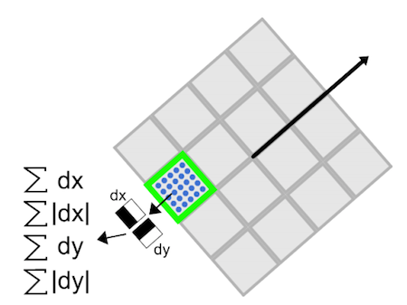

# Introduction

電腦視覺的常需要採用模型識別(pattern recognition)

# Algorithms
特徵檢測(feature extraction)是電腦視覺很重要的一部分，將影像原始的連續像素(pixels)資訊轉成某種鑑別性的特徵向量，以便作為後續歸類計算的依據特徵，演算法可分成全域性特徵和局部性特徵。

<!-- ## 全域性特徵演算法 -->

## 局部性特徵演算法：

### Keypoints(關鍵點) algorithms:
尋找影像的特殊位置的點，這個點所隱含的資訊對於物體識別有很重要的幫助，也可稱為興趣點(interest point)，可能會出現在邊緣(edge)或轉角上，像是角點(corner point)，但不涉及關鍵點的特徵描述。

1. Harris Corner Detection: 尋找影像中的角點，利用區域性滑動視窗在影像中找到梯度(Gradient)較大變化，而邊緣的轉角點正好會出現明顯的梯度變化。最後這些關鍵點經過非極大值抑制(Non-maximum Suppression)方法從每個局部區域挑出最大值(local maximum)的關鍵點，所以最後這些關鍵點是分散在整張影像中。[參考](https://docs.opencv.org/4.x/dc/d0d/tutorial_py_features_harris.html)

    **缺點**
    對角點的判斷方式很簡單，可能受到噪音干擾而誤判。
2. FAST:
FAST如其名比其他角點偵測演算法速度更快，將角點的定義為灰階影像中，若某畫素點的灰階值與其周圍領域內足夠多(預設12個)的畫素點的灰階值`>或<某種臨界值(Threshold value)`，則該畫素點可能為角點。將每個像素根據與臨界值(Threshold value)的比較分成三類`{darker,similar,brighter}`且利用分類器(classification)學習做角點偵測。最後同樣會執行非極大值抑制(Non-maximum Suppression)方法從每個局部區域挑出最大值(local maximum)的關鍵點。[參考](https://docs.opencv.org/4.5.2/df/d0c/tutorial_py_fast.html)
 
    **缺點**

    容易受到噪音和臨界值(Threshold value)的選定影響。

### Descriptors(特徵描述子):
從keypoints(關鍵點)的局部區域計算出特徵向量
1. SIFT(Scale-Invariant Feature Transform):
   第一個被提出的尺度不變性(Scale-Invariant)演算法，發表在1999年的國際頂級會議ICCV，至今還是在CV領域被廣泛使用。SIFT使用尺度空間極值檢測(Scale-space Extrema Detection)找出關鍵點，其取得的特徵不會隨影像的尺寸變化和旋轉而被改變，對於亮度變化也能容忍，SIFT本身就包含尋找關鍵點(keypoints)的功能，在關鍵點的相鄰區域對於選定的尺度圖上使用histogram(直方圖)統計相鄰像素的gradient magnitude(梯度強度)和方向(8種方向)，最後取得`16*8=128維度的描述子`。[參考](https://docs.opencv.org/4.x/da/df5/tutorial_py_sift_intro.html)

   

   **缺點**

   運算複雜度高因此較耗費時間，而且作者申請專利要向使用者收費，但在2020年已經到期，從non-free類別移動到free類別，參考官方[issue](https://github.com/opencv/opencv/issues/16736)。 
   

2. SUFT(Speeded-Up Robust Features):
   加速版本的SIFT，改用盒子率波器(Box filter)替代在SIFT利用高斯差(Difference of Gaussian)來逼近LoG(Laplacian of Gaussian)，減少實際所需的計算量。特徵描述子則計算水平與垂直向的Haar小波響應(Wavelet responses)，每個子區域採取4個特徵，總共取得維度有`4 * 4 * 4=64維度`，為增強特殊性已經有擴展到128維的版本。
   [參考](https://docs.opencv.org/4.x/df/dd2/tutorial_py_surf_intro.html)
   

3. BRIEF(Binary Robust Independent Elementary Features):
   以快速的計算方式取得二進位編碼的描述子，在關鍵點以高斯分佈區域內隨機選擇幾個點，並且每對彼此比較灰階值大小，組成128~512長度的二元字串為描述子。[參考](https://docs.opencv.org/4.x/dc/d7d/tutorial_py_brief.html)

   **缺點**
   
   利用pixel資訊進行比較，抗雜訊的能力較差，不具有尺度與旋轉不變性。

4. ORB(by default): 
Opencv開發出來為了替開發者`省下`付給SIFT和SURF演算法的專利費用，而開發出來的`免費`替代品.ORB結合FAST keypoint detector和BRIEF descriptor且進行改良，稱為`Oriented FAST`與`Rotated BRIEF`，強化特徵描述子的尺度與旋轉不變性，同時對噪音及透視仿射也具有不變性。
     - Oriented FAST:
       特徵描述子區塊使用moment方法來描述關鍵點的方向。
     - Rotated BRIEF：
       透過旋轉矩陣(rotation matrix)計算出旋轉後的座標且算出特徵描述子。

    
