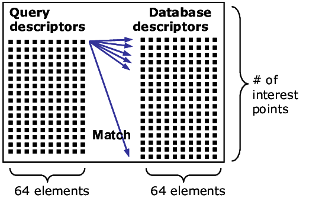

# Introduction

將前述的特徵粹取所取得的特徵作分類，將其判斷為N類別中的一類，

# Algorithms
## Similarity-based classification

1. Brute-Force:
   非常單純的做法，描述子特徵需要與其他的描述子特徵做匹配，用距離計算(distance calculation)來排列出最近的描述子特徵，Opencv有`NORM_L1/2系列的歐式距離和Hamming distance系列可選擇`，預設則是使用`NORM_L2`，`Hamming distance`即是兩個相同長度的序列（sequence）在相同位置上，有多少個數值不同。Opencv官方說SIFT和SURF使用NORM表現較好，但若使用二元編碼的描述子像是ORB, BRIEF等等應該使用Hamming distance系列的方法運算。Opencv提供BFMatcher.match(crossCheck參數True則回傳最佳匹配組，False(預設)則回傳全部組) 和BFMatcher.knnMatch()，前者給出最佳匹配結果，後者指回傳前k個最佳匹配組。[參考](https://docs.opencv.org/4.5.3/d2/de8/group__core__array.html#ggad12cefbcb5291cf958a85b4b67b6149fa7bacbe84d400336a8f26297d8e80e3a2)
   
   **缺點**
   暴力匹配運算複雜度高。

2. KNN(K-nearest neighbors):
   很經典且直覺的演算法，在已知全部數據的類別資訊情況下，把自己歸類成距離最鄰近的K個對象裡面統計最多的類別。Opencv有提供FLANN(Fast Library for Approximate Nearest Neighbors)方法，包括多種最近鄰居(Nearest Neighbors)演算法，聲稱在大數據下速度會比Brute-Force快。目前演算法有k-d樹演算法（The Randomized k-d TreeAlgorithm)，K-means等等詳細清單可參考[原始碼](https://github.com/opencv/opencv/pull/8245)。

   [參考1](https://docs.opencv.org/4.5.0/dc/dc3/tutorial_py_matcher.html) |
   [參考2](https://opencv24-python-tutorials.readthedocs.io/en/latest/py_tutorials/py_feature2d/py_matcher/py_matcher.html)  
   **缺點**
   需要手動挑最佳的K值，每一次運算都需要跟全部的對象計算距離，因此運算時間和空間隨著資料量擴大而成長。

## Learning-based classification
機器學習模型框架可分成監督式（supervised learning），半監督式(semi-supervised learning)和非監督式學習(unsupervised learning)，常見的分群(Clustering)演算法就是屬於非監督式學的一種．
* https://docs.opencv.org/4.x/dc/dd6/ml_intro.html

* SVM(support vector machine)